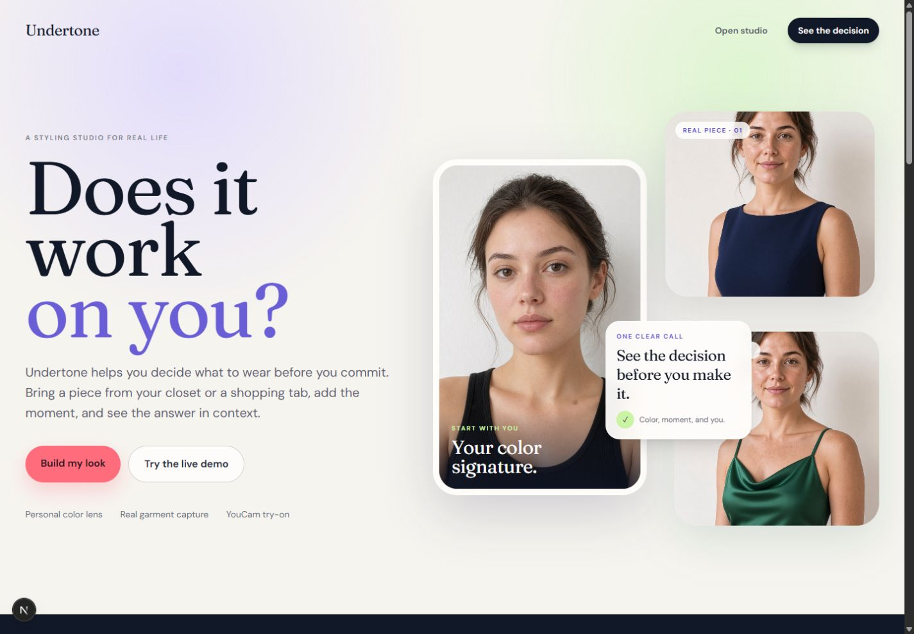
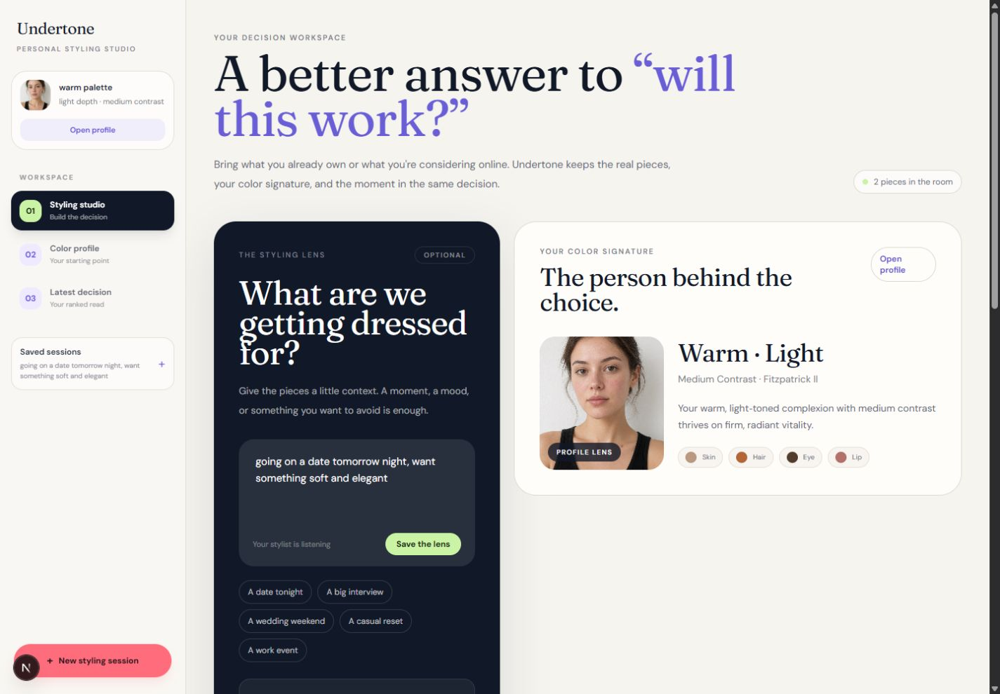

# Undertone

Undertone is a skin-aware styling studio for one practical question:

> Does this garment work on me, for this moment, before I commit to it?

It combines a YouCam skin/color profile, real garments from a wardrobe or shopping page, a lightweight styling lens, explainable ranking, and YouCam apparel virtual try-on. The product is deliberately a decision tool, not a generic fashion chatbot or a catalog browser.

## What the product does

1. A selfie creates the person-specific color signature.
2. The user adds a moment in natural language, or skips it.
3. Garments arrive from local uploads or the Manifest V3 browser companion.
4. Every garment is scored locally; only the strongest directions use YouCam apparel VTO.
5. The result is a clear recommendation with evidence, tradeoffs, and an optional deeper read.

The application has three connected workspace surfaces:

- **Styling studio** — intent, profile snapshot, look board, capture/upload entry points.
- **Color profile** — dedicated profile reveal, palette, visual signals, and reusable guidance.
- **Latest decision** — strongest direction, tradeoff, ranked pieces, YouCam try-on, and detailed analysis overlay.

## Product preview

The repository includes two current product captures: the landing story and the working styling studio.





## Architecture

```text
                                  +------------------+
                                  |      USER        |
                                  +--------+---------+
                                           |
                    +----------------------+----------------------+
                    |                                             |
          +---------v---------+                           +-------v--------+
          |  Next.js web app  |                           | MV3 companion  |
          | landing + studio |                           | crop garment   |
          | profile + result |                           | from a store   |
          +---------+---------+                           +-------+--------+
                    | REST / multipart                           |
                    +----------------------+----------------------+
                                           v
                            +--------------+--------------+
                            |       FastAPI API           |
                            | sessions + media + routes  |
                            +------+----------+-----------+
                                   |          |
                         +---------v--+    +--v----------------+
                         | Session    |    | External vision   |
                         | store      |    | YouCam Skin AI    |
                         | Supabase   |    | Color Tone        |
                         | or JSON    |    | Fitzpatrick       |
                         +------------+    +-------------------+
                                   |
                         +---------v--------------------------+
                         | Fixed fusion pipeline             |
                         | profile + intent + garment data   |
                         +---------+--------------------------+
                                   |
                    +--------------+--------------+
                    |                             |
          +---------v----------+        +---------v----------+
          | Deterministic     |        | Structured text     |
          | color extraction  |        | Groq primary        |
          | harmony scoring   |        | Gemini fallback     |
          +---------+----------+        +--------------------+
                    |
          +---------v----------+
          | Top-K selector     |
          | score all, render  |
          | strongest only    |
          +---------+----------+
                    |
          +---------v----------+
          | YouCam Apparel VTO |
          | visual try-on      |
          +---------+----------+
                    |
                    +-----------> Decision UI + evidence
```

The request path is intentionally bounded:

```text
selfie → YouCam profile → profile guidance
garments → image storage + local color extraction
intent → structured styling lens
profile + intent + garments → rules score → text reasons → Top-K → YouCam VTO
```

The LLM is used for intent parsing, concise explanations, and guidance. It is not treated as the source of garment pixels. The backend sanitizes model text before it reaches the UI, including leaked markdown fences and color hex tokens.

## Run locally with Docker

Copy `.env.example` to `.env` at the repository root and add the provider credentials before starting the containers. The real `.env` is intentionally not part of the repository.

Minimum live configuration:

- `YOUCAM_API_KEY` — required for the YouCam skin/color profile and Apparel VTO calls. Keep the default `YOUCAM_BASE_URL` unless your YouCam workspace uses another endpoint.
- `GOOGLE_API_KEY` — Gemini API key for intent parsing, styling explanations, and garment vision. The current demo can run with Gemini as the only LLM provider; leave `GROQ_API_KEY` empty for that setup.

Optional configuration:

- `GROQ_API_KEY` — optional Groq provider. If both providers are configured, the `LLM_PRIMARY` setting controls the text provider; the example defaults to Groq with Gemini fallback.
- `SUPABASE_URL` and `SUPABASE_SERVICE_ROLE_KEY` (or `SUPABASE_SECRET_KEY`) — optional persistent session and media storage. `SUPABASE_ANON_KEY` is not required for the current server-side demo. Without Supabase credentials, the API uses local JSON and disk storage.
- `NEXT_PUBLIC_API_URL` — normally `http://localhost:8000` for the Docker setup.

The YouCam and Gemini credentials are the only provider keys needed for the primary live demo path. Never commit `.env` or paste provider keys into source files.

### Optional Supabase persistence

Supabase is not required to run the project locally. If no Supabase credentials are present, the API automatically creates and uses `apps/api/data/` for session JSON and `apps/api/storage/` for uploaded media. No Supabase dashboard setup is needed for that path.

To enable cloud-backed sessions and media:

1. Create or open a Supabase project.
2. In the Supabase dashboard, open **SQL Editor**, create a new query, paste the complete contents of `supabase/schema.sql`, and click **Run** once.
3. Copy the project URL into `SUPABASE_URL` in the root `.env` file.
4. Copy the server-only service-role key into `SUPABASE_SERVICE_ROLE_KEY` (or use `SUPABASE_SECRET_KEY`). The current backend does not require `SUPABASE_ANON_KEY` for this flow.
5. Restart the API with `docker compose up -d --build`.

The SQL creates the session tables, media buckets, and read policies used by the application. The backend still keeps a local fallback if Supabase is unavailable or a cloud write fails. Never expose or commit the service-role/secret key; it belongs only in the local `.env` or the server’s secret configuration.

From the repository root:

```powershell
cd C:\Users\smeer\Desktop\youcam
docker compose up --build
```

Docker is the recommended judge setup: it starts both the FastAPI service and the production Next.js web app, so a separate Node or Python installation is not required.

Open:

- Web app: http://localhost:3000
- API health: http://localhost:8000/api/health
- API docs: http://localhost:8000/docs

The web container is a production build. After source changes, rebuild it:

```powershell
docker compose up -d --build
```

For faster frontend iteration, run the API normally and start Next.js from `apps/web` with `npm run dev`.

## Judge quick start

The complete interactive experience requires Google Chrome because the shopping companion is a locally loaded Manifest V3 extension. The normal browser studio works without the extension, but the capture-from-retail-page flow does not work in Firefox or another browser.

After cloning the repository:

1. Copy `.env.example` to `.env` in the repository root.
2. Add `YOUCAM_API_KEY` and at least one language/vision provider key. For the simplest current setup, add `GOOGLE_API_KEY` for Gemini and leave `GROQ_API_KEY` empty. The YouCam key powers the skin/color profile and Apparel VTO; Gemini powers intent, explanations, and garment-image verification.
3. Optionally add the Supabase values and run `supabase/schema.sql` if persistent sessions and media storage are required. A local JSON/disk fallback is available for a short demo.
4. Start the stack from the repository root:

   ```powershell
   docker compose up --build
   ```

5. Confirm the services are ready:

   - Web app: `http://localhost:3000`
   - API health: `http://localhost:8000/api/health`
   - API docs: `http://localhost:8000/docs`

6. Load the companion in Chrome by following the steps in the **Chrome companion** section below.

If the web source or Dockerfile changes, rebuild the web image with `docker compose up -d --build`. If the extension source changes, use **Reload** on its extension card and refresh any retail tabs that were already open.

## The clean demo path

1. Open the landing page.
2. Choose **Try the live demo** / **See the decision**. The sample path opens the finished decision after the real demo pack is prepared.
3. Show the strongest direction, the tradeoff, and the full analysis overlay.
4. Return to the studio and show the profile page, moment lens, and look board.
5. For the interactive shopping beat, load the browser companion and capture a garment from a retail page.
6. Add the crop to the board, open the studio, and run the read with the captured item alongside local uploads.

The demo pack uses the canonical local imagery in `apps/api/app/assets/demo/` and `apps/web/public/demo/`. The demo endpoint attempts the live YouCam/LLM path and retains a local fallback profile so the story remains filmable when a provider is unavailable.

## Chrome companion

The companion is a locally loadable Chrome Manifest V3 extension. It does not contain API keys; it communicates with the local API at `http://localhost:8000`. It is intentionally not a Chrome Web Store installation for this hackathon demo.

1. Start Docker and wait for the web app and API health endpoint to respond.
2. Open Google Chrome. Do not use Firefox or another browser for this part.
3. Open `chrome://extensions`.
4. Enable **Developer mode**.
5. Choose **Load unpacked** and select the extension directory:
   `C:\Users\smeer\Desktop\youcam\apps\capture-extension`
6. Open Undertone at `http://localhost:3000/app` and keep that tab available. This creates or resumes the active styling session used by the companion.
7. Open a retail product page in another Chrome tab. The floating Undertone control should appear on supported HTTP/HTTPS pages.
8. Click the floating control, choose **Grab this look**, crop the garment, and choose **Add to board**.
9. Choose **Open styling studio**. The crop should appear in the active session’s look board alongside any local uploads.

The complete live path is:

```text
Chrome → retail page → floating Undertone control → Grab this look
→ crop → Add to board → Open styling studio → Read my look
```

If the floating control does not appear, refresh the retail tab after the extension is loaded. If the extension was reloaded, refresh both the retail tab and the Undertone tab so Chrome gives the content script a fresh extension context. If a crop is not visible in the board, confirm that the styling studio tab was opened at `http://localhost:3000/app` before capturing it.

When extension files change, click **Reload** on the extension card and refresh the retail tab. The extension does not need to be installed again.

## Frontend routes

| Route | Purpose |
|---|---|
| `/` | Editorial landing page and product story |
| `/app` | Styling studio / onboarding |
| `/app/profile` | Dedicated color profile |
| `/app/decision` | Dedicated ranked decision and evidence |

The active session id is carried in the query string so the browser companion and session switcher can return to the same workspace without a login wall during the hackathon demo.

## API surface

- `GET /api/health`
- `POST /api/sessions`
- `GET /api/sessions`
- `GET /api/sessions/{id}`
- `DELETE /api/sessions/{id}`
- `POST /api/sessions/{id}/profile`
- `PUT /api/sessions/{id}/intent`
- `PUT /api/sessions/{id}/preference`
- `POST /api/sessions/{id}/candidates`
- `POST /api/sessions/{id}/candidates/crop`
- `DELETE /api/sessions/{id}/candidates/{candidate_id}`
- `POST /api/sessions/{id}/analyze`
- `POST /api/sessions/{id}/demo`

## Environment

The important variables are documented in `.env.example`:

- YouCam API base URL and key
- Groq primary model credentials
- Gemini fallback credentials
- Supabase URL and keys
- `VTO_TOP_K` / candidate limits

Never commit `.env`, provider keys, Supabase service-role credentials, generated storage, or `.next` output.

## Project map

```text
apps/
  api/
    app/
      routers/          FastAPI endpoints
      services/         YouCam, LLM, storage, demo assets
      graph/            fixed scoring / explanation / VTO pipeline
      models/           internal session schemas
  web/
    src/app/            landing, studio, profile, decision routes
    src/components/     shell, overlays, loading and status UI
    src/lib/             API client, Zustand state, display helpers
  capture-extension/   Manifest V3 floating capture companion
supabase/               schema and storage setup
PRODUCT_SPEC.md         product truth
IMPLEMENTATION_PLAN.md  build and architecture truth
LICENSE                 proprietary repository terms
```

## Verification

Frontend checks:

```powershell
cd apps\web
npm run lint
npm run build
```

Backend syntax check:

```powershell
cd apps\api
python -m compileall -q app
```

The most important manual acceptance path is: selfie/profile → local garment → browser crop → board → moment → analysis → ranked YouCam try-on → detailed read.

## License

This repository is proprietary. See [LICENSE](LICENSE). No commercial reuse, redistribution, or derivative product rights are granted without written permission.
